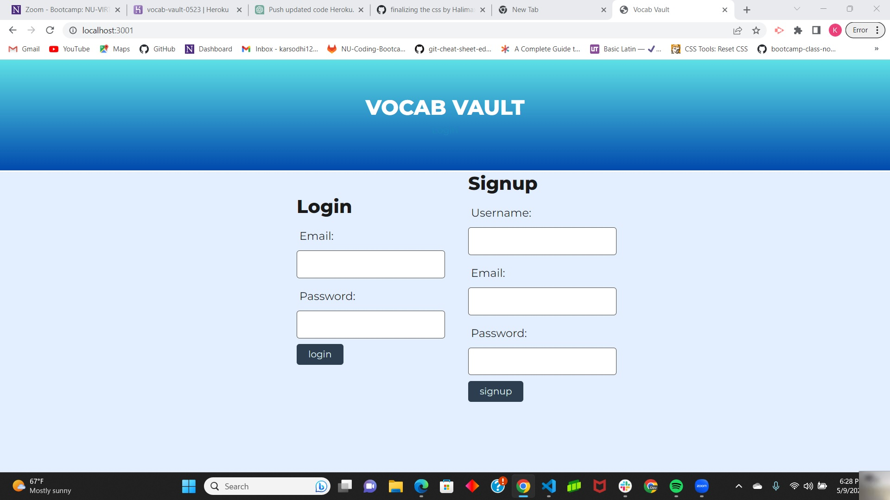
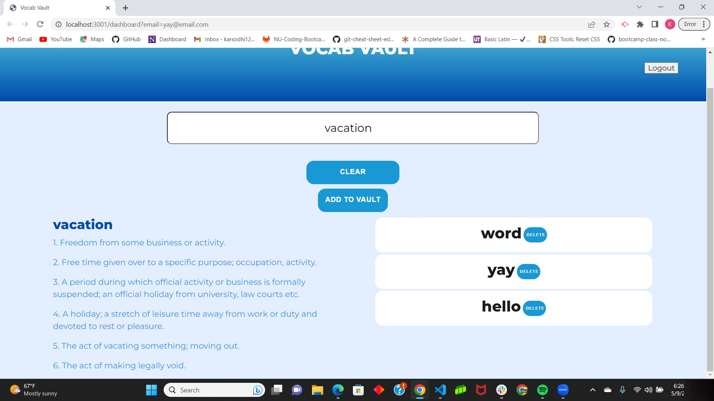

# Vocab Vault

## Description

We are tasked with creating a interactive full-stack application using Node.js and Express.js.  

## Installation

To install and run the app on your local machine, follow these steps:

Clone the repository to your local machine.

Install the necessary dependencies by running npm install.

Start the server by running npm start.

Open a web browser and go to http://localhost:3000.

## Usage

To use the app, follow these steps:

Use the heroku link given below or open the app in your web browser.

Type a vocabulary word in the search box and hit enter.

The definition for the word will auto-populate on the page.

Click the "Save" button to save the word for future use, or click the "Delete" button to remove it from your saved words.

To view your saved words, click the "Saved Words" button on the pag

## Screenshots

## Links
https://github.com/The-word-warriors/vocab-vault

https://vocab-vault-0523.herokuapp.com/

## Credits

Collaborators are [Halima](https://github.com/Halimaxo), [Matt](https://github.com/mattwagner28), [Rachel](https://github.com/rachelmcallister1), and [Kar](https://github.com/karsodhi).

